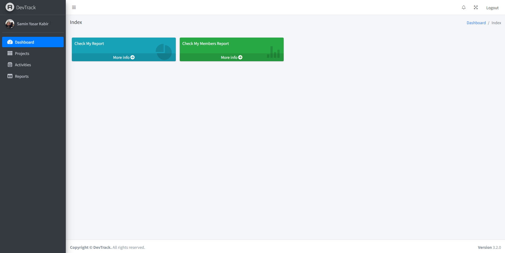
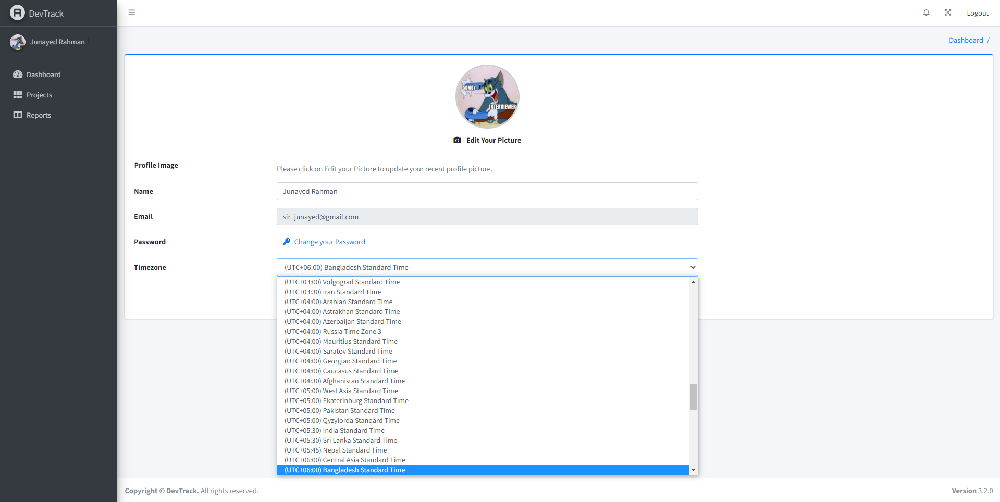

# DevTrack

A web application with ASP.NET Core to track activities from users such as tracked time, 
mouse clicks, screenshots, web camera images, and running 
applications on the desktop. The tracking data is fetched from a 
desktop application using Web API (RESTful). This project was developed as the final project of the ASP.Net Core training course from Dev Skill. 

Users can create new projects and invite others to the project by email. 
The invitation email is sent using Worker Service. Four others and I 
worked collaboratively to develop this project within a month. We have 
used the MSSQL server to store the data, and the project has been 
Dockerized.

Owners or the users can also examine or print their report(data which are fetched from Web API) to see their time tracking details which includes Screenshots, WebCaputures, Keyboard Hits, Mouse Hits, Running Programs and Windows.

## Web API
|  |  |  |  |
|---------|---------|---------|---------|
|  |  |  |  |

## Web Application
### Login and Sign Up
|  |  |
|---------|---------|
|  | |

### Dashboard
|  |
|---------|
|  |

### Project Creation, Editing & Details
|  |  |  |  |
|---------|---------|---------|---------|
|  |  |  |  |
|  |  |  |
|  |  |  

### Report
|  |  |  |  |
|---------|---------|---------|---------|
|  | |

### Settings
|  |  |
|---------|---------|
|  | |

## License

This project is licensed under the [Apache License 2.0](LICENSE).
